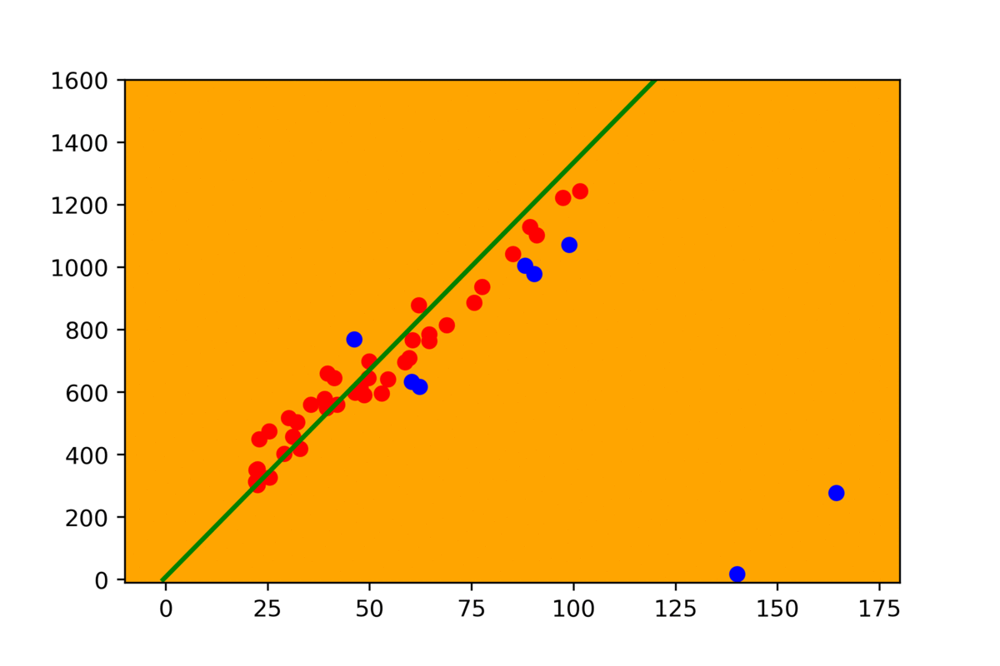

<h1 style="text-align: center;">Lidar Data Optimization using RANSAC Algorithm</h1>

  

---------------------------------------------

## ★ About this Project:
The project harnesses the RANSAC algorithm to enhance the integrity of LiDAR data for autonomous navigation systems. LiDAR, with its precise distance measuring capability, is crucial for autonomous vehicles and robots, enabling them to perceive their surroundings with high resolution. However, this data is often contaminated with outliers due to various sources of noise, which can lead to inaccurate representations of the environment and potentially unsafe navigation decisions.

By applying RANSAC, the project aims to effectively distinguish between these outliers and the valid inliers. RANSAC is a robust statistical tool that iteratively selects a random subset of the data to estimate the parameters of a mathematical model (for example, lines, curves, or surfaces in the case of LiDAR data). It is particularly suited to this task because of its ability to ignore outliers that would skew the results in traditional least squares estimation techniques.

  

---------------------------------------------

## ★ What is RANSAC:

RANSAC, or Random Sample Consensus, is an algorithm used to estimate the parameters of a mathematical model from a dataset that contains many outliers. It works by randomly selecting a subset of the data points and using these to estimate the model parameters. These parameters are then used to determine which of the remaining points in the dataset can be considered inliers, fitting the estimated model within a certain tolerance. This process is repeated multiple times, with the best model being the one that results in the highest number of inliers.

The strength of RANSAC lies in its robustness; it is designed to work well even when the noise level is high, making it ideal for applications where precision is paramount and data can be highly contaminated with errors. It's a go-to method in fields such as computer vision and robotics, where it is used for tasks like object recognition, terrain mapping, and is particularly instrumental in processing LiDAR data for autonomous vehicles, ensuring the reliability of the data used for navigation and obstacle avoidance.

---------------------------------------------

## ★ Why RANSAC for LiDAR:
The core objective of your project is to leverage this filtered data to ensure safe and efficient navigation for autonomous systems. By providing a cleaner, more accurate dataset, the autonomous system can perform more reliable terrain mapping and obstacle detection, which are integral for path planning and collision avoidance. This refined data processing pipeline allows for a higher level of confidence in the vehicle's ability to interpret its environment, make decisions, and navigate through complex scenarios.

In the broader context, your project stands to significantly advance the field of autonomous navigation. By integrating sophisticated data processing techniques like RANSAC with LiDAR data in ROS, and scripting in rospython, your work contributes to the development of more reliable and resilient autonomous vehicles. These vehicles are better equipped to handle the uncertainties of real-world operation, making them safer and more effective at navigating without human intervention.

  

---------------------------------------------

## ★ Project Observations and Results:

  

 

  

 

  

---------------------------------------------

## ★ My Project Video Demonstration:

  
  

---------------------------------------------
